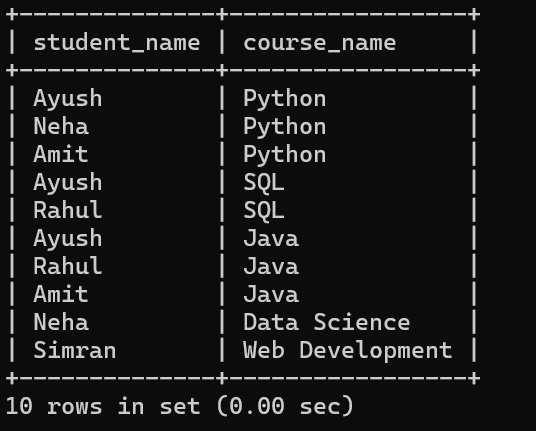
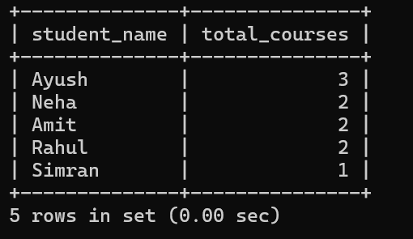

# 🎓 Student Course Management System

## 📌 Overview

This project demonstrates database design and core SQL operations using MySQL.

It manages students and courses using a **many-to-many relationship** and includes queries for data retrieval and analysis.

---

## 🧱 Features

* Manage students and courses
* Many-to-Many relationship (student ↔ course)
* JOIN queries to fetch combined data
* GROUP BY to calculate total courses per student
* VIEW for simplified queries
* Stored Procedure for student enrollment

---

## 🗂️ Project Structure

* `schema.sql` → database and table creation
* `data.sql` → inserting sample data
* `queries.sql` → JOIN and aggregation queries
* `views.sql` → view creation
* `procedures.sql` → stored procedure

---

## 🚀 How to Run

```bash
mysql -u root -p
```

```sql
SOURCE schema.sql;
SOURCE data.sql;
SOURCE queries.sql;
SOURCE views.sql;
SOURCE procedures.sql;
```

---

## 📸 Sample Output

### Join Result



### Course Count per Student



---

## 💡 Concepts Used

* Primary Key
* Foreign Key
* Composite Key
* JOIN
* GROUP BY
* VIEW
* Stored Procedure

---

## 🎯 Purpose

This project was built to practice SQL fundamentals and understand relational database design and querying.

---

## 👨‍💻 Author

Ayush Kumar Sharma
